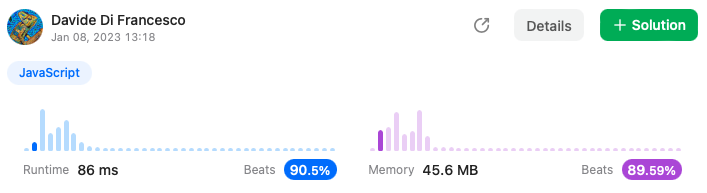

## Zigzag Conversion

The string `"PAYPALISHIRING"` is written in a zigzag pattern on a given number of rows like this: (you may want to display this pattern in a fixed font for better legibility)

```
P   A   H   N
A P L S I I G
Y   I   R
```

And then read line by line: `"PAHNAPLSIIGYIR"`

Write the code that will take a string and make this conversion given a number of rows:

```
string convert(string s, int numRows);
```

 

**Example 1:**

```
Input: s = "PAYPALISHIRING", numRows = 3
Output: "PAHNAPLSIIGYIR"
```

**Example 2:**

```
Input: s = "PAYPALISHIRING", numRows = 4
Output: "PINALSIGYAHRPI"
Explanation:
P     I    N
A   L S  I G
Y A   H R
P     I
```

**Example 3:**

```
Input: s = "A", numRows = 1
Output: "A"
```

 

**Constraints:**

- `1 <= s.length <= 1000`
- `s` consists of English letters (lower-case and upper-case), `','` and `'.'`.
- `1 <= numRows <= 1000`


## Solution

```js
var convert = function(s, numRows) {
    if (numRows === 1) return s; 
    const zigzag = new Array(s.length).fill(' '); 
    let index = 0; 
    for (let i = 0; i < s.length; i += 2 * (numRows - 1)) { 
        zigzag[index++] = s[i];
    }
    for (let i = 1; i < numRows - 1; i++) { 
        let j = i, step = 2 * (numRows - 1 - i); 
        while (j < s.length) {
            zigzag[index++] = s[j];
            j += step;
            step = 2 * (numRows - 1) - step; 
        }
    }
    for (let i = numRows - 1; i < s.length; i += 2 * (numRows - 1)) { 
        zigzag[index++] = s[i];
    }
    return zigzag.join('');
};
```

## Score

