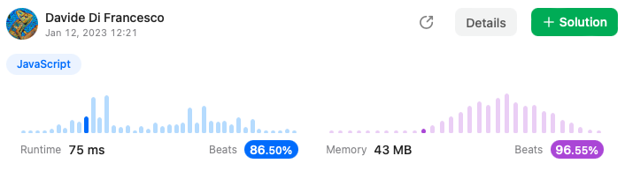

## Reverse Integer

Given a signed 32-bit integer `x`, return `x` *with its digits reversed*. If reversing `x` causes the value to go outside the signed 32-bit integer range `[-2^31, 2^31 - 1]`, then return `0`.

**Assume the environment does not allow you to store 64-bit integers (signed or unsigned).**

 

**Example 1:**

```
Input: x = 123
Output: 321
```

**Example 2:**

```
Input: x = -123
Output: -321
```

**Example 3:**

```
Input: x = 120
Output: 21
```

 

**Constraints:**

- `-2^31 <= x <= 2^31 - 1`


## Solution

```js
var reverse = function(x) {
    const MIN_32 = 0x1 << 31;
    const MAX_32 = ~(0x1 << 31);

    let result = 0;
    let last = 0;

    while (x) {
        last = x % 10;
        x = (x - last) / 10;
        result = result * 10 + last;
        if (result > MAX_32 || result < MIN_32) return 0;
    }

    return result;
};
```

## Score

